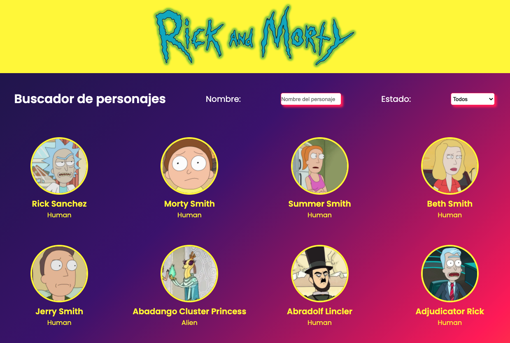
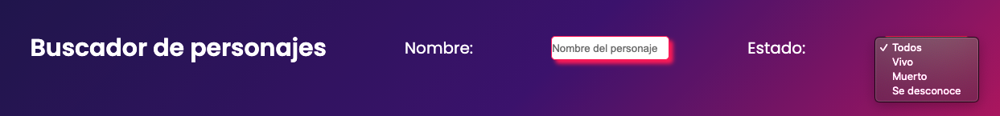
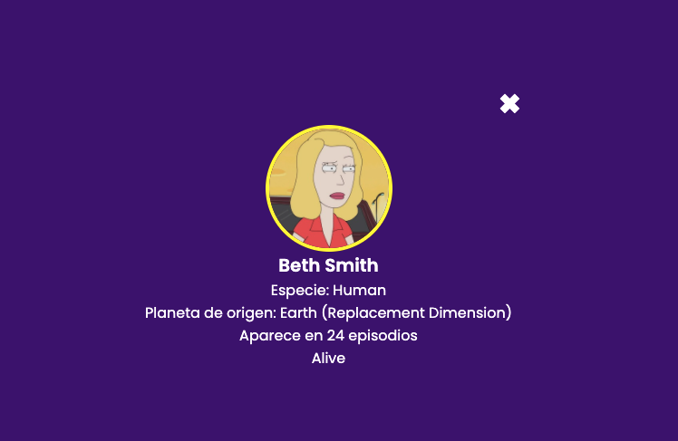

# modulo-3-evaluacion-final-moniLamas

## Desarrollar una página web con un listado de personajes de Rick and Morty, que podemos filtrar por el nombre del personaje. Vamos a usar React para realizarlo.

### SOBRE EL PROYECTO

He diseñado y desarrollado **Rick and Morty. Buscador de personajes**
He creado un panel para organizar el proceso con GitHub projects, [click para abrir el panel](https://github.com/Adalab/modulo-3-evaluacion-final-moniLamas/projects/1)

#### Página de inicio



#### Buscador



#### Detalles del personaje



## Enunciado del ejercicio

<details>

<summary>Requerimientos para realizar el ejercicio</summary>
  
#### 1. Listado de personajes
En primer lugar, vamos a realizar una web con el listado de personajes de Rick and Morty. Para eso, vamos a utilizar el servicio de https://rickandmortyapi.com/documentation/#get-all-characters que nos devuelve información sobre los primeros 20 personajes de la serie. Sobre cada uno, vamos a pintar al menos:
  - Foto 
  - Nombre 
  - Especie
  
#### 2. Filtrado de personajes
Ahora que ya tenemos el listado de personajes en pantalla, la segunda parte consiste en poder buscarlos por nombre. Para eso, añadimos un input a la interfaz, de forma que al ir escribiendo un nombre queden en la interfaz solo los personajes cuyo nombre contiene las letras escritas. En el pantallazo de arriba, al escribir 'Ric' aparecen personajes cuyo nombre completo contiene esas letras en ese orden.
  
#### 3. Componentes del listado de personajes
El listado debe tener los siguientes componentes como mínimo:
  - Componente para el filtro de nombre.
  - Componente para el listado.
  - Componente para la tarjeta de cada personaje del listado. Componente para el detalle de cada personaje.
  
#### 4. Detalle de personajes
Vamos a implementar una nueva funcionalidad: al hacer clic sobre la tarjeta de un personaje, su información aparecerá a pantalla completa. Para hacer esto usaremos rutas y React Router DOM. En la pantalla de detalle aparecerá además de la foto, nombre y especie, el planeta de origen, el número de episodios en los que aparece y si está vivo o muerto.

#### 5. Detallitos de calidad

- Como nos gusta cuidar la semántica, el campo de texto debe estar recubierto por una etiqueta <form />.
- Si estando en el campo de filtrado pulsamos intro debéis impedir que el navegador navegue o cambie la ruta sin querer.
- Si se busca por un texto por ejemplo "XXX" y no hay ningún personaje que coincida con dicho texto se debe mostrar un mensaje del tipo "No hay ningún personaje que coincida con la palabra XXX".
- El filtro debe filtrar independientemente de que la usuaria introduzca el texto en mayúsuclas o minúsculas.
- Al entrar en el detalle de un personaje y a continuación pulsar atrás, el campo de texto debe mostrar el texto que tenía anteriormente.

#### 6. BONUS: Afinar la maquetaciónBONUS: Mejoras visuales

Para terminar, podéis realizar algunas mejoras visuales del ejercicio. Por ejemplo:
Mostrar la especie y si un personajes está muerto con un icono. Usar algún sistema de grid para pintar el listado de personajes. Que funcione bien el responsive en dispositivos pequeños.

#### 7. BONUS: URL compartible

- Como ejercicio extra os proponemos que la URL del detalle de personaje sea compartible, es decir, que si visitamos esa URL directamente en el navegador se vea el detalle del personaje. Si refescamos el navegador en el detalle de un personaje debe volver a mostrar el detalle del personaje.
- Y en el caso de que el usuario navegue a una URL inexistente como por ejemplo http://localhost:3000/#/detail/12345 (el id 12345 no existe) debemos mostrar un mensaje del tipo "El personaje que buscas no existe".

#### 8. BONUS: Ordenación

Un extra interesante sería que ordenáseis el listado de personajes alfabéticamente por nombre.

#### 9. BONUS: Más filtros

Un extra interesante sería que añadáis más filtros para filtrar por ejemplo por especie.

  </details>

### CONSTRUIDO CON

<p align="left"> <a href="https://www.gnu.org/software/bash/" target="_blank">  </a> <a href="https://www.w3schools.com/css/" target="_blank">  </a> <a href="https://git-scm.com/" target="_blank">  </a> <a href="https://es.reactjs.org/" target="_blank">  </a> <a href="https://www.w3.org/html/" target="_blank">  </a> <a href="https://developer.mozilla.org/en-US/docs/Web/JavaScript" target="_blank">  </a> <a href="https://sass-lang.com" target="_blank">  </a> </p>

## Comenzando

### Prerrequisitos

Instalar en el terminal react
`npm install -g create-react-app`

### npm

Instalar npm en su terminal, siguiendo las instrucciones detalladas en la página oficial de [Node](https://nodejs.org/es/download/)

### Instalación

1. Clona el repo
   ```sh
   git clone https://github.com/Adalab/modulo-3-evaluacion-final-moniLamas.git
   ```
2. Instalar los paquetes NPM
   ```sh
   npm install
   ```
3. Ejecutar el comando para visualizar en su navegador
   ```sh
   npm start
   ```

## Contribuir

Las contribuciones son lo que hace que la comunidad de código abierto sea un lugar increíble para aprender, inspirar y crear. Cualquier contribución que hagas es **muy apreciada**.

1. Fork del proyecto
2. Crea tu rama de características (`git checkout -b feature/AmazingFeature`)
3. Confirme sus cambios (`git commit -m 'Add some AmazingFeature'`)
4. Empuja a la rama (`git push origin feature/AmazingFeature`)
5. Abrir un Pull Request

## Licencia

Distribuido bajo la licencia MIT. Ver `LICENSE` para más información.

## Contacto

Estoy disponible en Twitter - [Moni Lamas](https://twitter.com/MoniMonipeny)
